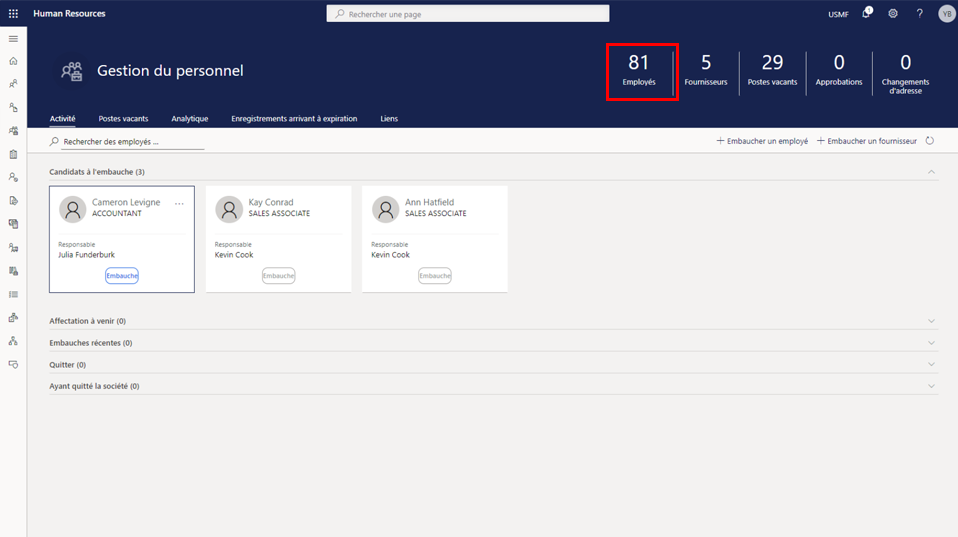

---
demo:
    title: 'Démonstration 1 : Affectation des cours de formation'
    module: 'Module 4 : Découvrir les principes de base de Microsoft Dynamics 365 Human Resources'
---

## Démonstration 1 : Affectation des cours de formation

1. Accédez à la page d’accueil de **Microsoft Dynamics 365 Human Resources**.  
    Dans Microsoft Dynamics 365 Human Resources, les responsables de la gestion du personnel peuvent affecter des cours de formation aux employés. Dans cet exemple, Alicia vient de rejoindre la société et doit suivre la formation disponible aux employés pendant leurs trente premiers jours.

1. Vérifiez que vous vous connectez bien à la société **USMF** dans le sélecteur de société situé dans le coin supérieur droit. Si tel n’est pas le cas, sélectionnez **USMF**.

1. Dans le coin supérieur gauche de l’écran, sélectionnez l’onglet **Gestion du personnel**.

1. Sur la droite de la page **Gestion du personnel**, cliquez sur le matricule juste au-dessus d’**Employés**.

    

1. Dans le tableau **Employés**, sélectionnez le nom de l’employé à qui affecter la formation. Par exemple, **Alicia Thornber**.  
    Ensuite, utilisez l’onglet Compétences et développement pour afficher des liens vers des informations relatives aux certifications, formations et compétences de l’employée.

1. Sur la page de l’employée, sélectionnez l’onglet **Compétences et développement**.

1. Dans la section **Compétences**, sélectionnez **Cours**.  
    La page Cours des employés vous permet de consulter les cours déjà affectés. Dans le cas d’Alicia, aucun cours n’apparaît. Pour consulter les cours disponibles, sélectionnez le menu ID cours.

1. Sélectionnez le menu **ID cours**.

1. Dans le tableau Cours, sélectionnez le menu **ID cours**.

1. Dans le menu **ID cours**, sélectionnez le menu **Statut des cours**.

1. Dans le menu **Statut des cours**, sélectionnez la case **Statut des cours est exactement**.  
    Vous devrez peut-être modifier le filtre **ID cours** appliqué (par exemple, pour afficher uniquement les cours en cours).

1. Dans la zone **Statut des cours est exactement**, saisissez **En cours**.

1. Dans le menu **Statut des cours**, sélectionnez **Appliquer** pour afficher tous les cours disponibles en cours.  
    Vous pouvez maintenant affecter à Alicia la formation destinée aux nouveaux employés.

1. Sélectionnez le cours à affecter. Par exemple, **00006 Formation des nouveaux employés**.

1. Dans le volet Transférer les données de cours, sélectionnez **Oui**.

1. Sur la page **Cours**, sélectionnez l’**icône représentant un calendrier** dans la colonne **Date de début**.

1. Dans le calendrier, sélectionnez la date de début. Par exemple, le **5 janvier 2021**.

1. Dans la colonne **Date de fin**, sélectionnez l’**icône représentant un calendrier**.

1. Dans le calendrier, sélectionnez la date de fin de la formation. Par exemple, le **8 janvier 2021**.

1. Sur le côté gauche de la page **Cours**, sélectionnez **Enregistrer** pour enregistrer vos modifications.

1. Sur le côté droit de la page **Cours**, sélectionnez le **X** pour fermer la page.  
    Pour modifier un cours affecté, sélectionnez à nouveau Cours.

1. Sur la page de l’**employée**, sélectionnez **Cours** dans la section **Compétences**.

1. Sur la page **Cours**, sélectionnez **Édition** dans la barre de navigation pour apporter des modifications.

1. Dans la colonne **Date de début**, sélectionnez l’**icône représentant un calendrier**.

1. Sélectionnez la nouvelle date de début du cours. Par exemple, le **6 janvier 2021**.

1. Sélectionnez **Enregistrer**.

1. Sélectionnez l’icône en forme de **X** pour fermer la page.

1. Sur la page de l’ **employée**, sélectionnez l’icône en forme de **X** pour fermer la page.
