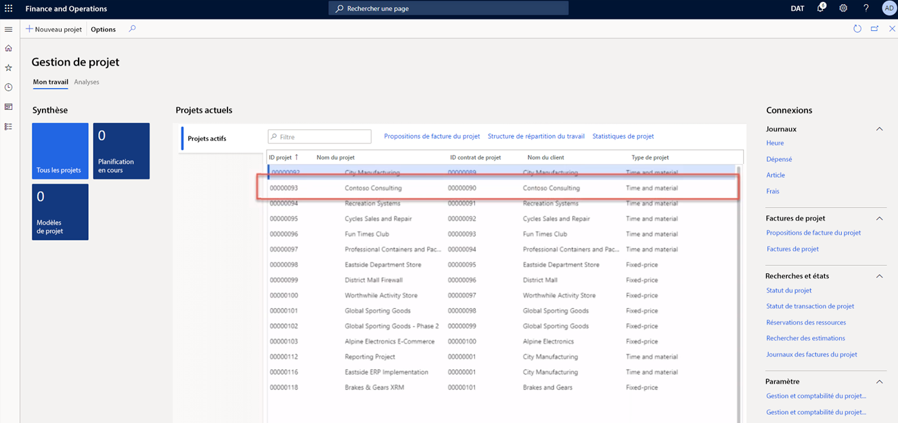
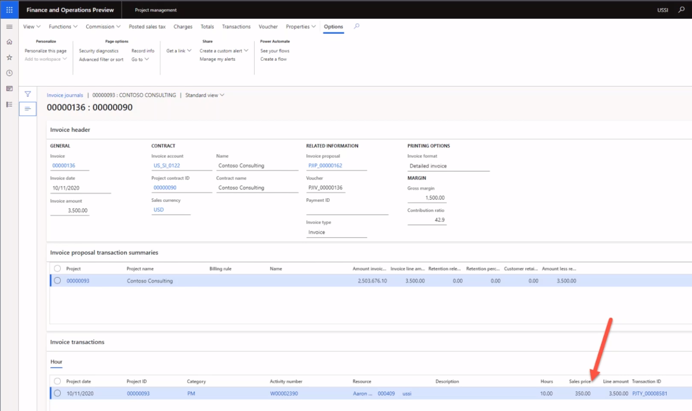
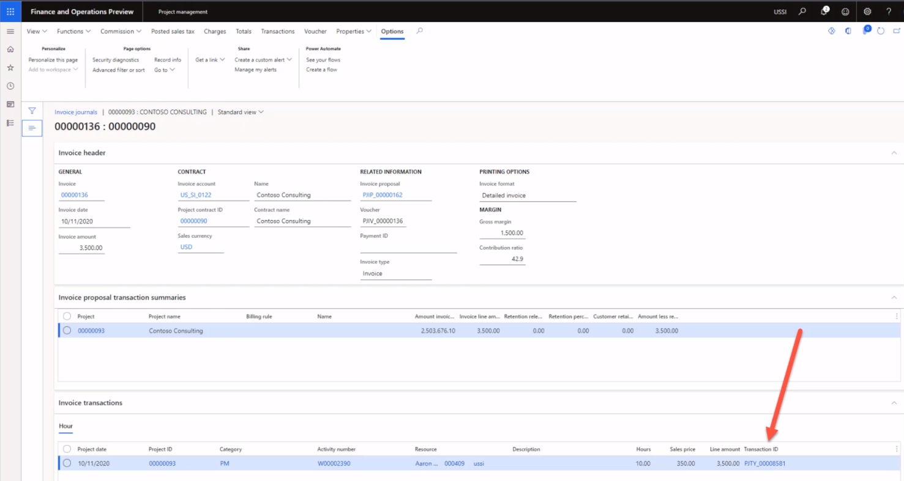

---
demo:
  title: "Démo 1\_: Tarification dans Project Operations"
  module: 'Module 5: Learn the Fundamentals of Microsoft Dynamics 365 Project Operations'
---

## Démonstration 1 : Tarification dans Project Operations

1. Accédez à l’espace de travail **Gestion de projets**.  
    Dans cette démonstration, nous allons paramétrer des prix de vente et de revient dans Project Operations. Nous allons également voir comment dériver les coûts et les prix d’une facture précédemment validée.

1. Vérifiez que vous êtes bien connecté à l’entité juridique **USSI** dans le sélecteur de société situé dans le coin supérieur droit.  
    Si tel n’est pas le cas, sélectionnez l’organisation **USSI**.

1. Dans le tableau **Projets actifs**, sélectionnez le projet **00000093 Contoso Consulting**. Vous accédez ainsi à la vue détaillée du projet.

    

1. Sur la page **Contoso Consulting**, sélectionnez l’onglet **Gérer** dans la barre de navigation.

1. Dans le menu **Gérer**, sélectionnez **Journaux des factures**.  
    Ici, nous avons localisé une facture où des heures ont été appliquées.

1. Sous **Transactions de facture**, pointez sur **350,00** dans la colonne **Prix de vente**.  
    Dans cette vue, nous pouvons constater que le taux de charge de la ressource Aaron Con, un chef de projets d’USSI, est de 350 dollars. Passons en revue le paramétrage de la tarification pour découvrir comment le taux a été défini.

      

    Même s’il est possible de consulter les prix depuis le projet individuel, nous allons commencer par l’espace de travail **Gestion de projets** afin de visualiser le paramétrage de la tarification dans son intégralité.

1. Accédez à l’espace de travail **Gestion de projets**.

1. Sur le côté droit de l’écran, dans la section **Liens**, puis dans le sous-menu **Paramétrage**, sélectionnez **Prix de vente (heure)** .

1. Sur la page **Prix de vente (heure)** , pointez sur **350,00** dans la colonne **Tarification** du tableau.  
Dans cette vue, nous pouvons voir où a été paramétré le prix de vente d’Aaron Con qui s’élève à 350 dollars.

1. Pointez sur la première ligne tout entière.  
    Si nous nous intéressons à l’intégralité de la ligne, nous constatons qu’Aaron est paramétré comme un chef de projets et que le taux est associé à un ID projet spécifique pour Contoso Consulting.

1. Dans la colonne **Ressource**, pointez sur toutes les autres lignes où des ressources sont affectées.  
    Ce tableau nous indique que d’autres chefs de projets ont été paramétrés, mais qu’ils ne sont pas affectés à des ID projet spécifiques. Par conséquent, leurs taux ne sont spécifiques qu’à la catégorie et aux ressources affectées.

      

    Cette matrice est assez flexible pour prendre en charge le niveau de détail constaté pour Contoso Consulting et Aaron Con, mais aussi un modèle de tarification plus générique, comme le prix de 300 dollars affiché ici.

1. Pour le projet Contoso, accédez à la page **Journaux des factures**.  
    En retournant à la facture validée, nous allons nous intéresser à la même transaction d’heures validée et passer en revue les coûts associés à Aaron Con en sélectionnant l’ID transaction sur la ligne de la transaction de facture.

1. Dans la section **Transactions de facture**, sélectionnez l’onglet **Heure**. Dans le tableau qui s’affiche, sélectionnez un ID transaction dans la colonne **ID transaction**.

    

1. Sur la page **Transactions horaires**, sélectionnez l’onglet **Vue d’ensemble**. Dans le tableau qui s’affiche, pointez sur **200,00** dans la colonne **Prix de revient**.  
    Dans la vue des transactions horaires, nous remarquons une entrée pour Aaron Con, dont le prix de revient associé est de 200 dollars. Retournons en arrière et intéressons-nous au paramétrage du prix de revient pour identifier l’origine de ce taux de revient.

1. Accédez à l’espace de travail **Gestion de projets**.

1. Sur le côté droit de l’écran, dans la section **Liens**, puis dans le sous-menu **Paramétrage**, sélectionnez **Prix de revient (heure)** .

1. Sur la page **Vue standard du prix de revient (heure)** , dans le tableau, pointez sur la ligne indiquant **01/01/2014** dans la colonne **Date d’effet**, **CP** dans la colonne **Catégorie**, **200,00** dans la colonne **Prix de revient** et aucune valeur dans les autres colonnes.  
    Dans cette vue, nous constatons qu’un prix de revient de 200 dollars a été paramétré pour la catégorie CP, mais aucune autre ligne n’est spécifique à Aaron ou à notre projet Contoso Consulting. Cette pratique est courante, puisque de nombreuses organisations de services choisissent d’appliquer des taux standard par catégorie, c’est-à-dire un rôle dans le projet dans le cas présent. Il s’agit souvent d’un taux moyen où le taux de salaire de la ressource individuelle n’est stocké que dans le système de paie ou de ressources humaines. Le taux de coût standard est alors ajusté périodiquement, lorsque les coûts des salaires sont analysés pour s’assurer qu’ils sont corrects et que les marges sont bien respectées.

    

1. Accédez à l’espace de travail **Gestion de projets**.

1. Sur le côté droit de l’écran, dans la section **Liens**, puis dans le sous-menu **Paramétrage**, pointez sur **Prix de revient (heure)** et **Prix de vente (heure)** .  

Dans cette démonstration, nous avons découvert le paramétrage des prix de vente et de revient standard dans Project Operations. Nous avons passé en revue leur impact sur une facture validée afin de réaliser que le paramétrage de ces prix affecte directement la facture de régie présentée.
