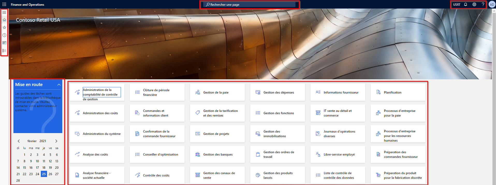
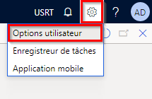
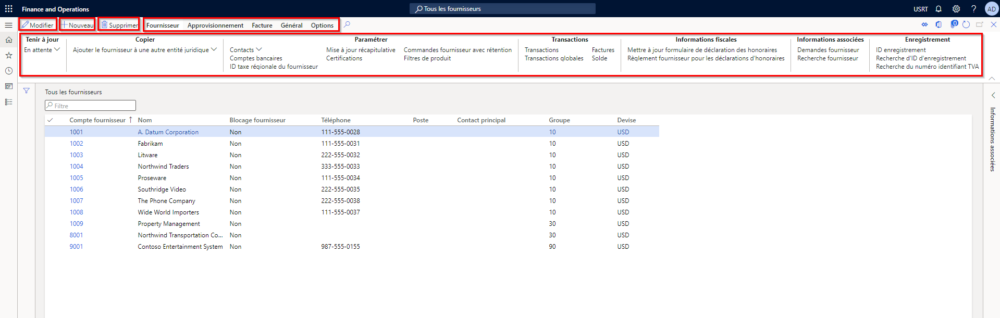
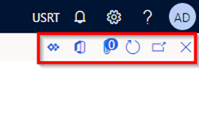

---
lab:
  title: "Labo\_1\_: Parcourir les applications Finance and Operations"
  module: 'Module 1: Explore the core capabilities of Dynamics 365 finance and operations apps'
---

# Module 1 : Explorer les fonctionnalités principales des applications de finances et d’opérations Dynamics 365

## Labo 1 : Parcourir les applications Finance and Operations

## Objectifs

Maintenant que vous vous êtes familiarisé avec les applications Finance and Operations, prenez le temps de découvrir l’interface.

## Mise en place du labo

- **Durée estimée** : 10 minutes

## Instructions

### Connectez-vous à l’ordinateur du labo

1. Connectez-vous à l’ordinateur du labo à l’aide des identifiants suivants

    - Nom d’utilisateur :

        Coller le contenu

        Administrateur

    - Mot de passe :

        Coller le contenu

        pass@word1

    >[!Note] Il est possible qu’Internet Explorer s’ouvre automatiquement sur le Bureau. Si vous n’avez pas encore terminé les étapes 2 à 5, terminez-les avant de retourner sur Internet Explorer.

1. Sélectionnez le fichier **AdminUserProvisioning** sur le Bureau.

1. Saisissez les identifiants fournis et sélectionnez **Envoyer**.  
Vous trouverez vos identifiants dans le menu **Ressources** situé dans le coin supérieur droit de l’écran.

1. Attendez la fin du script avant de continuer. Cette opération peut prendre 2 à 3 minutes. Une fois le script terminé, une zone contextuelle s’affiche pour confirmer la mise à jour de l’utilisateur administrateur.

1. Sélectionnez **OK** pour continuer.

1. Ouvrez **Internet Explorer**.

1. Rendez-vous à l’adresse fournie : <https://usnconeboxax1aos.cloud.onebox.dynamics.com>

1. Connectez-vous à l’aide des identifiants fournis dans le menu **Ressources**.

### Parcourir les applications Finance and Operations
1. Si elle est configurée, la page d’accueil de Finance and Operations affiche les éléments suivants :

    - Le menu de navigation à gauche, qui est réduit par défaut

    - Le logo de votre société

    - Les vignettes d’espace de travail à votre disposition en fonction de votre rôle dans l’organisation

    - Un calendrier et des éléments de travail qui vous sont affectés

    - La barre de recherche, qui est très utile pour rechercher rapidement ce dont vous avez besoin

    - La société que vous utilisez actuellement, les notifications, les paramètres et les liens d’aide en haut à droite  
    Vérifiez que la société indiquée est bien **USMF**.

    

1. En haut à gauche, sélectionnez le menu hamburger **Développer le volet de navigation**.

1. Le volet de navigation contient des collections pour vos **Favoris**, vos éléments **Récents**, vos **Espaces de travail** et vos **Modules**.

1. Dans le volet de navigation, sélectionnez **Modules** > **Administration du système**.

1. Passez en revue les zones disponibles dans le module Administration système.

1. Sous **Configuration**, sélectionnez **Options de performances client**.

1. Dans le volet Options de performances du client, sous **Légendes de fonction activées**, positionnez le bouton bascule sur **Oui**.

1. Passez en revue les autres options disponibles, faites défiler le volet vers le bas, puis cliquez sur **OK**.

1. En haut à droite de la page d’accueil, cliquez sur l’icône Paramètres, puis sélectionnez Options utilisateur.

    

1. Sur la page Options, utilisez les onglets pour configurer différents paramètres qui s’appliqueront à votre compte.

1. Sélectionnez l’onglet **Préférences**.

1. Passez en revue les préférences disponibles. Notez que vous pouvez modifier la société par défaut et la vue de page initiale qui s’affiche lorsque vous vous connectez.

1. Sélectionnez et examinez les onglets **Compte** et **Flux de travail**.

1. Dans le menu de navigation à gauche, cliquez sur l’icône **Accueil**.

1. En haut au centre de la page d’accueil, cliquez sur la zone **Rechercher une page**.

1. Dans la zone de recherche, recherchez **Tous les fournisseurs**.

1. Vous devrez peut-être patienter la première fois que vous recherchez une page. Un petit cercle tournant s’affiche à droite de la zone de recherche pendant le traitement de la recherche.

1. La page Tous les fournisseurs est un exemple de page de liste. La page de liste contient généralement des données principales qui peuvent être lues, créées, supprimées et mises à jour. Vous voyez des fonctionnalités supplémentaires à l’aide du ruban affiché au-dessus de la liste.

    

1. Mettez en surbrillance l’un des fournisseurs de la liste, cliquez sur le menu **Informations associées** à droite, puis passez en revue les informations supplémentaires fournies.

1. Dans la liste des fournisseurs, sélectionnez **Fournitures de bureau ACME**.

1. Cliquez sur le menu **Groupe**, puis sélectionnez le titre de colonne **Groupe de fournisseurs**.

    

1. De nombreux menus proposent des options de tri et de filtrage. Utilisez les filtres pour trouver rapidement le contenu de champ que vous recherchez.

1. En haut à droite, notez les fonctionnalités supplémentaires. Déplacez votre souris sur chaque élément et examinez la légende de la fonctionnalité. Ensuite, cliquez sur l’icône **Fermer** pour fermer la page et revenir à la page d’accueil.

    

1. En haut à droite, cliquez sur l’icône d’**Aide** en forme de point d’interrogation, puis sélectionnez **Aide**.

1. Notez que les informations d’aide concernent la page active.

1. Tentez de cliquer sur une vignette d’espace de travail, puis consultez les informations d’aide sur l’espace de travail concerné. Ensuite, revenez à la page d’accueil.
