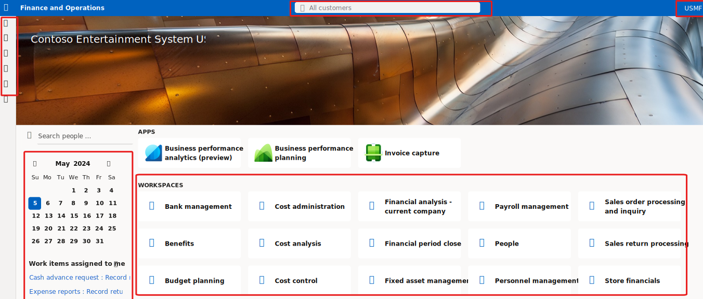

---
lab:
  title: "Labo\_1.1\_: Parcourir les applications Finance and Operations"
  module: 'Learning Path 1: Explore the core capabilities of Dynamics 365 finance and operations apps'
---

# Parcours d’apprentissage 1 : Explorer les fonctionnalités principales des applications de finances et d’opérations Dynamics 365
# Module 1 : Décrire les applications de finances et d’opérations

## Labo 1.1 : Parcourir les applications Finance and Operations

## Objectif

Maintenant que vous vous êtes familiarisé avec les applications Finance and Operations, prenez le temps de découvrir l’interface.

## Mise en place du labo

- **Durée estimée** : 10 minutes

## Instructions

### Connectez-vous à l’ordinateur du labo

1.  Connectez-vous à l’ordinateur du labo à l’aide des identifiants suivants :

    - Nom d’utilisateur : `Administrator`

    - Mot de passe : `pass@word1`

1.  Ce labo a été configuré pour approvisionner automatiquement votre compte d’utilisateur administrateur. Une fois terminé, Edge s’ouvre automatiquement et vous invite à vous connecter et vous pouvez vous connecter avec les informations d’identification fournies dans l’onglet Ressources. Si ce processus échoue, consultez la note ci-dessous. Sinon, vous pouvez poursuivre le labo. 

    >Sur le Bureau, double-cliquez sur AdminUserProvisioning.
Dans le champ Adresse e-mail, entrez le nom d’utilisateur à partir de **Ressources**, puis cliquez sur Envoyer.
Attendez que l’invite vous informe que l’utilisateur administrateur a bien été mis à jour… puis cliquez sur OK.   

1.  **Microsoft Edge** ouvre l’URL Finance & Operations : <https://usnconeboxax1aos.cloud.onebox.dynamics.com>

1.  Connectez-vous à l’aide du nom d’utilisateur et du mot de passe fournis dans le menu **Ressources**. 

### Parcourir les applications Finance and Operations

Maintenant que vous vous êtes familiarisé avec les applications Finance and Operations, prenez le temps de découvrir les interfaces.

1.  Si elles sont configurées, la page d’accueil **Finance and Operations** affiche les éléments suivants :

    - Le menu de navigation à gauche, qui est réduit par défaut.

    - Le logo de votre société.

    - Les vignettes d’espace de travail à votre disposition en fonction de votre rôle dans l’organisation.

    - Un calendrier et des éléments de travail qui vous sont affectés.

    - La barre de recherche, qui est utile pour rechercher rapidement ce dont vous avez besoin.

    - La société que vous utilisez actuellement, les notifications, les paramètres et les liens d’aide en haut à droite. Vérifiez que la société indiquée est bien **USMF**.

    
2.  En haut à gauche, sélectionnez le menu hamburger **Développer le volet de navigation**.

3.  Le volet de navigation est l’endroit où se trouvent des collections pour vos **Favoris**, vos éléments **Récents**, vos **Espaces de travail** et vos **Modules**.

4.  Dans le volet de navigation, sélectionnez **Modules** > **Administration du système**.

5.  Passez en revue les zones disponibles dans le module Administration système.

6.  Sous **Configuration**, sélectionnez **Options de performances client**.

7.  Dans le volet **Options de performances du client**, sous **Légendes de fonction activées**, positionnez le bouton bascule sur **Oui**.

8.  Passez en revue les autres options disponibles, faites défiler le volet vers le bas, puis cliquez sur **OK**.

9.  En haut à droite de la page d’**accueil**, cliquez sur l’icône **Paramètres**, puis sélectionnez **Options utilisateur**.

    

10. Dans la page **Options**, utilisez les onglets pour configurer différents paramètres qui s’appliquent à votre compte.

11. Sélectionnez l’onglet **Préférences**.

12. Passez en revue les préférences disponibles. Notez que vous pouvez modifier la société par défaut et la vue de la page initiale lorsque vous vous connectez.

13. Sélectionnez et examinez les onglets **Compte** et **Flux de travail**.

14. Dans le menu de navigation à gauche, cliquez sur l’icône **Accueil**.

15. En haut au centre de la page d’**accueil**, sélectionnez la zone **Rechercher une page**.

16. Dans la zone de recherche, recherchez **Tous les clients**.

17. Sélectionnez **Comptabilité client** > **Clients** > **Tous les clients**. 

18. Vous devrez peut-être patienter la première fois que vous recherchez une page. Un petit cercle tournant s’affiche à droite de la zone de recherche pendant le traitement de la recherche.

19. La page **Tous les clients** est un exemple de page de liste. La page de liste contient des données principales qui peuvent être lues, créées, supprimées et mises à jour. D’autres fonctionnalités sont disponibles dans le ruban au-dessus de la liste.

    

20. Mettez en surbrillance l’un des clients de la liste. Sur la droite, sélectionnez le menu **Informations associées**, puis passez en revue les informations supplémentaires fournies.

    

21. Dans la liste **Clients**, sélectionnez **Contoso Retail San Diego**.

22. Sélectionnez le menu **Groupe**, puis le titre de colonne **Groupe de clients**.

    

23. De nombreux menus proposent des options de tri et de filtrage. Utilisez les filtres pour trouver rapidement le contenu de champ que vous recherchez.

24. En haut à droite, notez les fonctionnalités supplémentaires. Déplacez votre souris sur chaque élément et examinez la légende de la fonctionnalité. Quand vous avez terminé, cliquez sur l’icône **Fermer** pour fermer la page et revenir à la page d’**accueil**.

    

