---
lab:
    title: 'Labo 2 : Découvrir les espaces de travail et le filtrage'
    module: 'Module 1 : Découvrir les principes de base de Microsoft Dynamics 365 Supply Chain Management'
---

# Module 1 : Découvrir les principes de base de Microsoft Dynamics 365 Supply Chain Management

## Labo 2 : Découvrir les espaces de travail et le filtrage

## Objectifs

De nombreux espaces de travail intégrés sont disponibles lorsque vous vous connectez pour la première fois à Finance and Operations. Vous pouvez également créer votre propre espace de travail avec un contenu axé sur l’un de vos éventuels besoins. Les espaces de travail sont l’une des nombreuses fonctionnalités de Dynamics 365, mais sachez également que le filtrage est le moyen d’accéder réellement aux éléments spécifiques que vous recherchez. Vous devez créer un espace de travail personnalisé et utiliser le filtrage pour identifier les différents éléments dont vous avez besoin.

## Mise en place du labo

   - **Durée estimée** : 10 minutes

## Instructions

1. Sur la page d’accueil de Finance and Operations, à droite des vignettes d’espace de travail, cliquez avec le bouton droit ou appuyez longuement sur une zone vide pour déclencher le menu.

    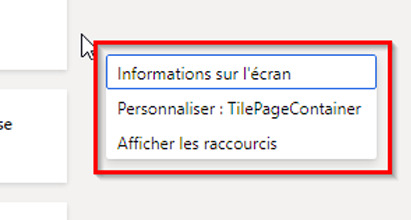

1. Dans le menu, sélectionnez **Personnaliser : TilePageContainer**.

1. Dans la fenêtre Personnaliser, cliquez sur **+ Ajouter un espace de travail**.

1. Si la petite fenêtre Personnaliser n’est pas visible, tentez de faire défiler la page d’accueil vers le haut et cliquez avec le bouton droit ou appuyez longuement sur une zone vide, puis sélectionnez de nouveau l’option **Personnaliser : TilePageContainer**.

    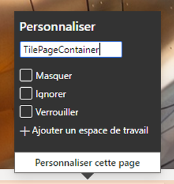

1. Sur la page d’accueil, faites défiler vers le bas, puis recherchez la nouvelle vignette **Mon espace de travail 1**.

    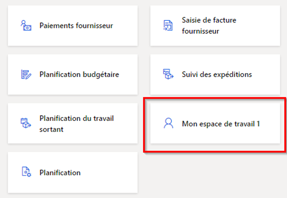

1. Cliquez avec le bouton droit ou appuyez longuement sur la vignette, puis sélectionnez l’option **Personnaliser : Mon espace de travail 1**.

1. Dans la fenêtre Personnaliser, renommez Mon espace de travail 1 en **Mon espace de travail**, puis cliquez sur **Personnaliser cette page**.  
    Le changement de nom s’enregistre automatiquement.

1. Dans la barre d’outils nouvellement ouverte, sélectionnez **Déplacer**.

    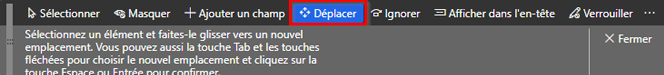

1. Sélectionnez votre vignette **Mon espace de travail**, puis déplacez-la vers un autre emplacement sur la page d’accueil.

    >[!Remarque] Si vous ne parvenez pas à déplacer la vignette, actualisez la page et réessayez les étapes précédentes afin de la déplacer.

1. Fermez la barre d’outils.

1. Dans la zone **Rechercher une page** de la page d’accueil, recherchez et sélectionnez **Tous les fournisseurs**.

1. Dans le menu supérieur de la page Tous les fournisseurs, sélectionnez **Options** > **Ajouter à l’espace de travail**.

1. Dans la zone de filtre **Espace de travail**, saisissez **Mon espace de travail**, puis sélectionnez l’espace de travail.

1. Cliquez sur le menu Présentation, passez en revue les options disponibles, puis sélectionnez **Vignette**.

1. Ensuite, cliquez sur **Configurer**.

1. Dans le volet Ajouter en tant que vignette, vérifiez le nom de la vignette, puis cliquez sur **OK**.

1. Dans le volet de navigation à gauche, sélectionnez l’icône **Accueil**.

1. Sur la page d’accueil, sélectionnez votre nouvel espace de travail.

1. Sur la page Mon espace de travail, vérifiez que la vignette Fournisseurs nouvellement ajoutée s’affiche.

1. Sélectionnez la vignette **Fournisseurs**.

1. Sur la page Tous les fournisseurs, saisissez **Contoso** dans la zone **Filtre**.

1. Passez en revue les différents champs permettant de rechercher Contoso.

    

1. Sélectionnez **Nom : « Contoso »**, puis consultez les résultats du filtre.

1. Effacez la zone de filtre, puis appuyez sur Entrée pour afficher tous les fournisseurs.

1. Sélectionnez le titre de colonne **Groupe**.

    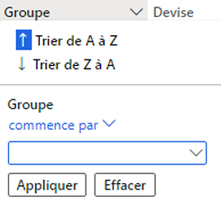

1. Il vous permet de trier les groupes par ordre alphabétique (Trier de A à Z) ou par ordre inversement alphabétique (Trier de Z à A).

1. Sous **Groupe**, cliquez sur le menu **commence par** et passez en revue les opérateurs de comparaison. Sélectionnez l’option **est exactement**.

1. Sélectionnez le menu sous **est exactement**, puis sélectionnez **Autres fournisseurs**.  
    Vous pouvez également saisir une valeur dans le champ de menu.

1. Cliquez sur **Appliquer**, puis consultez les résultats. Notez l’icône Filtrer dans l’en-tête de la colonne Groupe.

    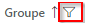

1. Cliquez sur la colonne **Groupe**, puis sélectionnez l’option **Effacer** dans le menu de filtre.

1. À gauche du titre Tous les fournisseurs, cliquez sur l’icône Filtrer.

    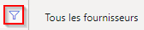

1. En haut à droite du volet Filtre, cliquez sur **+ Ajouter**.

1. Dans le volet Ajouter des champs de filtre, cochez la case à gauche de **Groupe**, puis sélectionnez Mettre à jour.

1. Notez le filtre supplémentaire qui a été ajouté. Il vous permet de filtrer la liste en fonction de plusieurs critères.

    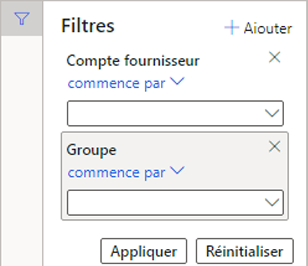

1. Dans le filtre **Le compte fournisseur commence par**, cliquez sur le menu, puis sélectionnez l’option **Northwind Traders**.

1. Dans le filtre **Le groupe commence par**, cliquez sur le menu, puis sélectionnez l’option **30**.

1. Sélectionnez **Appliquer**, puis consultez les résultats du filtre.

1. Dans le volet Filtres, cliquez sur **Réinitialiser** et notez que le filtre supplémentaire a été supprimé et que le filtre par défaut a été réinitialisé à une valeur vide.

1. Sélectionnez **Options** dans la barre de ruban, puis **Filtre ou tri avancé** dans la section Options de page.

    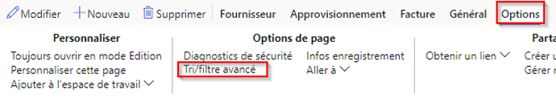

1. Dans la fenêtre Recherche - Fournisseurs, cliquez sur **+ Ajouter**.

1. Dans la cellule Champ de la nouvelle ligne, sélectionnez le menu, puis sélectionnez **Groupe**.

1. Vous pouvez également cliquer sur le menu, commencer à taper le nom du groupe, puis le sélectionner dans les résultats du filtre.

1. Dans la cellule Critères, cliquez sur l’icône **Ouvrir**.

    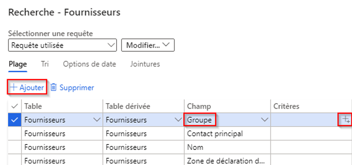

1. Dans la liste déroulante, sélectionnez le groupe de fournisseurs **30 Autres fournisseurs**.

1. Pour enregistrer la nouvelle requête, cliquez sur le menu **Modifier** sous **Sélectionner la requête**, puis cliquez sur **Enregistrer sous**.

    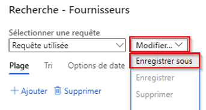

1. Dans le volet Enregistrer la requête, dans la zone **Nom**, saisissez Ma requête, puis sélectionnez **OK**.

1. Sur la page Recherche - Fournisseurs, cliquez sur **OK**.

1. Vérifiez que la liste reflète les résultats de la requête nouvellement créée.

1. Pour supprimer le filtre, sélectionnez **Filtre ou tri avancé**, avant de cliquer sur **Réinitialiser** sur la page Recherche - Fournisseurs, puis sur **OK**.

1. Vous réinitialisez ainsi la requête, mais sans supprimer votre requête enregistrée.
