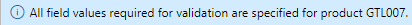

---
lab:
    title: 'Labo 3 : Créer une offre de produits avec différentes tailles et couleurs'
    module: 'Module 1 : Découvrir les principes de base de Microsoft Dynamics 365 Supply Chain Management'
---

# Module 1 : Découvrir les principes de base de Microsoft Dynamics 365 Supply Chain Management

## Labo 3 : Créer un nouveau produit

## Objectifs

Dans Contoso Entertainment System USA (USMF), vous devez créer un article pour une nouvelle configuration d’armoire à acheter auprès des fournisseurs.

## Mise en place du labo

   - **Durée estimée** : 10 minutes

## Instructions

1. Sur la page d’accueil de Finance and Operations, en haut à droite, vérifiez que vous travaillez avec la société USMF.

1. Si nécessaire, sélectionnez la société, puis, dans le menu, **USMF**.

1. En haut à gauche, sélectionnez le menu hamburger **Développer le volet de navigation**.

1. Dans le volet de navigation, sélectionnez **Modules** > **Gestion des informations sur les produits**, puis sous la catégorie **Produits**, **Produits lancés**.

1. Sur la page Détails des produits lancés, dans le menu du haut, sélectionnez **+ Nouveau**.

1. Dans le volet Nouveau produit lancé, dans le menu **Type de produit**, vérifiez qu’**Article** est sélectionné.

1. Dans le menu **Sous-type de produit**, vérifiez que **Produit** est sélectionné.

1. Dans le menu **Groupe de dimension de suivi**, sélectionnez **Aucun**.

1. Sous **IDENTIFICATION**, dans les zones **Numéro de produit** et **Numéro d’article**, saisissez **GTL007**.

1. Dans la zone **Nom du produit**, saisissez **Armoire 2**.

1. Sous **GROUPES DE RÉFÉRENCE**, sélectionnez le menu **Groupe de modèles d’article**, puis sélectionnez **FIFO premier entré, premier sorti**.

1. Dans le menu **Groupe d’articles**, sélectionnez **TV et vidéo**.

1. Dans le menu **Groupe de dimension de stockage**, sélectionnez **SiteWH**.

1. Sous **UNITÉS DE MESURES**, vérifiez que les valeurs suivantes sont définies :

    | **Paramètre**| **Valeur**|
    | :--- | :--- |
    | Unité de stock| ea Chaque|
    | Unité d’achat| ea Chaque|
    | Unité de vente| ea Chaque|
    | Unité de nomenclature| ea Chaque|

1. Sous **IMPOSITION SUR LES VENTES**, sélectionnez le menu **Groupe de taxe de vente d’article**, puis sélectionnez **TOUT**.

1. Sous **IMPOSITION SUR LES ACHATS**, sélectionnez le menu **Groupe de taxe de vente d’article**, puis sélectionnez **TOUT**.

1. Sous PRIX, dans la zone Prix d’achat, saisissez 30,00.

1. Dans la zone Prix de vente, saisissez 30,00.

1. Votre nouvelle version du produit doit ressembler à ceci :

    

1. Cliquez sur **OK**.

1. Pour vous assurer que le produit est finalisé, dans la barre de ruban, sous **Mettre à jour**, sélectionnez **Valider**.

    

1. Vérifiez que vous voyez la bannière d’information confirmant que toutes les valeurs de champ requises ont été validées.

    

1. Fermez toutes les pages et revenez à la page d’accueil.
