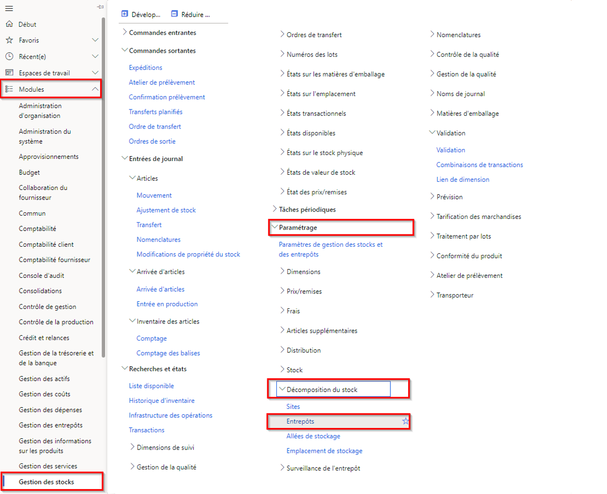
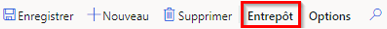

---
lab:
    title: 'Labo 5 : Créer un entrepôt'
    module: 'Module 1 : Découvrir les principes de base de Microsoft Dynamics 365 Supply Chain Management'
---

# Module 1 : Découvrir les principes de base de Microsoft Dynamics 365 Supply Chain Management

## Labo 5 : Créer un entrepôt

## Objectifs
Le système de gestion des entrepôts dans Supply Chain Management offre des moyens flexibles de définir la structure de votre entrepôt en vue de répondre à des besoins changeants afin que vous puissiez atteindre une efficacité d’entrepôt optimale.

- Vous pouvez établir des zones de stockage de haute priorité et basse priorité pour un placement optimal des produits.
- Vous pouvez diviser votre entrepôt en zones pour répondre à divers besoins de stockage, tels que les exigences de température ou les différents taux de rotation des articles.
- Vous pouvez spécifier les emplacements des entrepôts à n’importe quel niveau (par exemple, site, entrepôt, allée, rack, étagère et position d’un bac).
- Vous pouvez grouper les emplacements en utilisant des paramètres de contrainte de capacité physique.
- Vous pouvez contrôler le stockage et le prélèvement des articles, en fonction de règles définies par une requête.

Pour utiliser la gestion des entrepôts dans Supply Chain Management, vous devez créer un entrepôt et l’activer pour des activités de gestion des entrepôts plus avancées ou spécialisées.

## Mise en place du labo

   - **Durée estimée** : 10 minutes

## Instructions

1. Sur la page d’accueil de Finance and Operations, en haut à droite, vérifiez que vous travaillez avec la société USMF.

1. Si nécessaire, sélectionnez la société, puis, dans le menu, sélectionnez **USMF**.

1. Dans le volet de navigation de gauche, sélectionnez **Modules** > **Gestion des stocks** > **Configuration** > **Décomposition du stock** > **Entrepôts**.

    

1. Sur la page Entrepôts, sélectionnez **Nouveau** dans le menu supérieur.

1. Dans le champ **Entrepôt**, saisissez **101**.

1. Dans le champ **Nom**, tapez **Overflow Warehouse**.

1. Sélectionnez le menu **Site**, puis sélectionnez **3 Production de mousse isolante**.

1. Développez **Noms d’emplacement**.  
    Les options de cette section définissent le format par défaut des noms d’emplacement.

1. Définissez les options **Inclure allée** et **Inclure rayon** sur **Oui**.

1. Dans le champ **Format** pour le rayon, saisissez une valeur.  
    Par exemple, si le format du nom de l’emplacement du rayon doit contenir OVFL, vous devez saisir cette valeur dans le champ Format.

1. Sous **NIVEAU**, définissez l’option **Inclure étagère** sur **Oui**.

1. Dans le champ **Format** pour l’étagère, saisissez **-##**.

1. Dans le menu supérieur, sélectionnez **Entrepôt**.

    

1. Sous **Mettre à jour**, sélectionnez **Assistant Emplacement**.

1. Sur la page d’accueil, vérifiez les informations, puis sélectionnez **Suivant** dans le coin inférieur droit.

1. Décochez les cases **Quais d’expédition** et **Emplacements de stockage en gros**.

1. Sélectionnez **Suivant** et vérifiez les informations.

1. Continuez sur chaque page, puis une fois ce travail terminé, sélectionnez **Terminer**.

1. Fermez la page et revenez à la page d’accueil.
