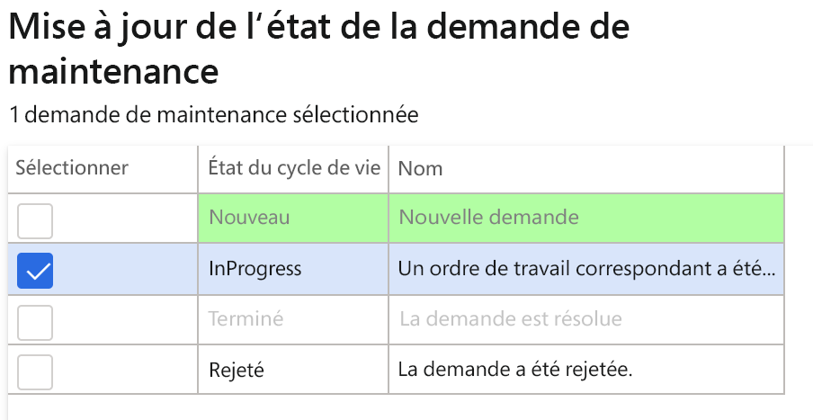
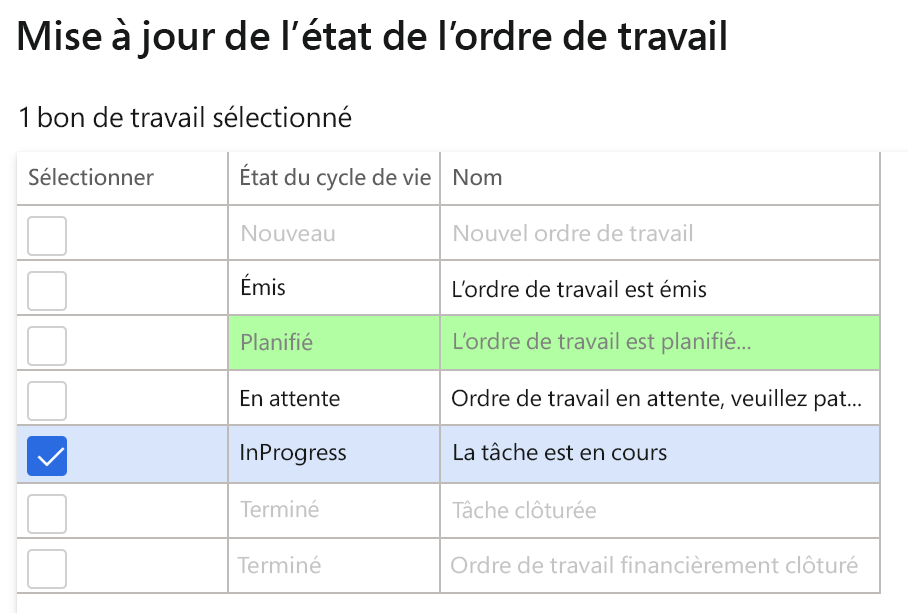
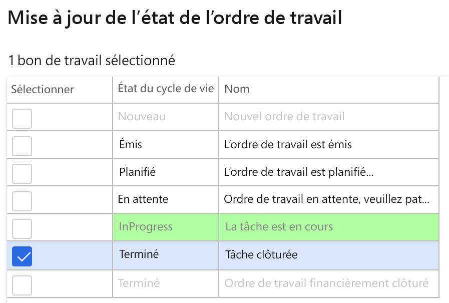

---
lab:
  title: 'Labo 7 : Créer un ordre de travail de maintenance'
  module: 'Module 1: Learn the Fundamentals of Microsoft Dynamics 365 Supply Chain Management'
ms.openlocfilehash: ae848333194143720a6f5ebb598d5d566bc2260f
ms.sourcegitcommit: 252458fca8e71b6e5e8b99ae4c2b47cd85461a30
ms.translationtype: HT
ms.contentlocale: fr-FR
ms.lasthandoff: 01/27/2022
ms.locfileid: "137909572"
---
## Labo 7 : Créer un ordre de travail de maintenance

**Objectifs**

Les ordres de maintenance créés dans le système décrivent l’intervention de maintenance ou la réparation nécessaire sur un actif et sont utilisés pour affecter les ressources appropriées pour traiter la demande. L’ordre de travail est créé sur la base de l’ordre de maintenance, qui est exécuté par la ressource allouée.

**Mise en place du labo**

Durée estimée : 15 minutes.

**Instructions**

1. Sur la page d’accueil de Finance and Operations, en haut à droite, vérifiez que vous travaillez avec la société USMF.

2. Si nécessaire, sélectionnez la société, puis, dans le menu, **USMF**.

3. Dans le volet de navigation de gauche, sélectionnez **Modules** **&gt; Gestion des actifs &gt; Configuration &gt; Demande de maintenance &gt; État du cycle de vie.**

4. Sélectionnez InProgress et cliquez sur le bouton **Modifier** dans le volet Action.

5. Sous l’onglet **Général**, modifiez la valeur **Créer un ordre de travail** sur Oui.

6. Dans le volet de navigation de gauche, sélectionnez **Modules** **&gt; Gestion des actifs &gt; Espaces de travail &gt; Gestion des demandes de maintenance.**

7. Cliquez sur **Créer une demande de maintenance**.

8. Entrez les valeurs suivantes dans les champs de la boîte de dialogue, puis cliquez sur le bouton **OK**.

    - Type de demande de maintenance : Corrective

    - Description : Bruit dans le détecteur de métal

    - Emplacement fonctionnel : PP-02-02

    - Ressource : MD-201

    - Niveau de service : 4

    - Symptôme de défaillance : Bruit excessif

    - Zone de défaillance : Électrique 

9. Fermez le formulaire **Demande de maintenance** et revenez à l’espace de travail **Gestion des demandes de maintenance**.

10. Actualisez la page en appuyant sur l’icône **Actualiser** en haut à droite de l’écran.

11. La nouvelle demande de maintenance s’affiche dans la liste des demandes de maintenance sans ordre de travail.

12. Sélectionnez la demande de maintenance que vous venez de créer et cliquez sur le bouton **Mettre à jour l’état de la demande de maintenance**. 

13. Dans la boîte de dialogue, cochez la case à côté de InProgress et cliquez sur **OK**

 

14. Sélectionnez la demande de maintenance que vous venez de créer et cliquez sur le bouton **Créer un ordre de travail**. 

15. Entrez les valeurs suivantes dans les champs de la boîte de dialogue, puis cliquez sur le bouton **OK**.

    - Type de travail de maintenance : Inspection

16. Un nouvel ordre de travail sera créé, et l’ordre de travail sera mis à jour dans l’enregistrement de la demande de maintenance sélectionnée.

17. Cliquez sur l’ordre de travail et accédez à l’écran **Détails de l’ordre de travail**.

18. Sous les lignes de l’ordre de travail, cliquez sur le bouton **Répartir**.

19. Entrez les valeurs suivantes dans les champs de la boîte de dialogue, puis cliquez sur le bouton **OK**.

    - Collaborateur : Ted Howard

20. Dans le menu Action, accédez à **Ordre de travail &gt; État du cycle de vie &gt; Mettre à jour l’état du cycle de vie.**

21. Dans la boîte de dialogue, cochez la case à côté de InProgress et cliquez sur **OK**

22. Sélectionnez la date et l’heure pour **Début réel** dans la boîte de dialogue et cliquez sur **OK.**

23. Dans le menu d’action Ordre de travail, accédez à **Ordre de travail &gt; État du cycle de vie &gt; Mettre à jour l’état du cycle de vie.**

24. Dans la boîte de dialogue, cochez la case à côté de InProgress et cliquez sur **OK**

25. Dans le champ **Fin réelle**, sélectionnez une date et une heure postérieures à celles de début, puis cliquez sur OK.

26. Vous trouverez l’état actuel du cycle de vie dans l’en-tête de l’ordre de travail (Terminé).
