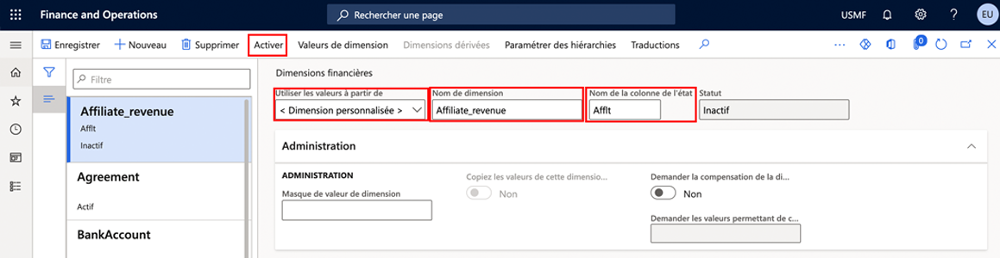
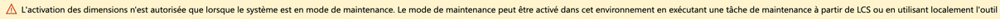

---
lab:
  title: 'Labo 1 : Créer une dimension financière'
  module: 'Module 2: Learn the Fundamentals of Microsoft Dynamics 365 Finance'
ms.openlocfilehash: 9bbc1a92cb719b988ddfa6a08e1e3b2d8c69976e
ms.sourcegitcommit: 252458fca8e71b6e5e8b99ae4c2b47cd85461a30
ms.translationtype: HT
ms.contentlocale: fr-FR
ms.lasthandoff: 01/27/2022
ms.locfileid: "137909583"
---
## Labo 1 : Créer une dimension financière

## Objectifs

Utilisez la page Dimensions financières pour créer des dimensions financières que vous pouvez utiliser comme segments de compte pour les plans de comptes. Il existe deux types de dimensions financières : les dimensions personnalisées et les dimensions reposant sur des entités. Les dimensions personnalisées sont partagées par plusieurs entités juridiques et les valeurs sont entrées et gérées par les utilisateurs. Pour les dimensions reposant sur des entités, les valeurs sont définies ailleurs dans le système, par exemple dans les entités Clients ou Magasins. Certaines dimensions reposant sur des entités sont partagées par plusieurs entités juridiques, tandis que d’autres sont spécifiques à une entreprise.

Vous devez créer une dimension financière personnalisée qui sera utilisée par votre entreprise.

## Mise en place du labo

   - **Durée estimée** : 5 minutes

## Instructions

1. Sur la page d’accueil de Finance and Operations, en haut à droite, vérifiez que vous travaillez avec la société USMF.

1. Si nécessaire, sélectionnez la société, puis, dans le menu, sélectionnez **USMF**.

1. Dans le volet de navigation de gauche, sélectionnez **Modules** > **Comptabilité** > **Plan comptable** > **Dimensions** > **Dimensions financières**.

1. Dans le menu en haut sélectionnez **+ Nouveau**.

1. Sur la page Dimensions financières, sélectionnez le menu **Utiliser les valeurs de**, puis **< Dimension personnalisée >** .

1. Dans le champ **Dimension**, saisissez **Affliate_Revenue**.

1. Dans la zone **Nom de la colonne de rapport**, saisissez **Afflt**.

1. Dans le menu du haut, sélectionnez **Activer**.

    

1. Vérifiez les informations dans la boîte de dialogue, puis cliquez sur **Fermer**.

1. Consultez la bannière de notification d’avertissement.

    

    >[!NOTE] Vous pouvez activer et désactiver le mode de maintenance directement au moyen de Lifecycle Services (LCS) dans vos environnements de bac à sable et de production. Pour plus d’informations sur la gestion des services de cycle de vie, consultez [https://docs.microsoft.com/en-us/dynamics365/fin-ops-core/dev-itpro/deployment/maintenanceoperationsguide-newinfrastructure](https://docs.microsoft.com/en-us/dynamics365/fin-ops-core/dev-itpro/deployment/maintenanceoperationsguide-newinfrastructure).
