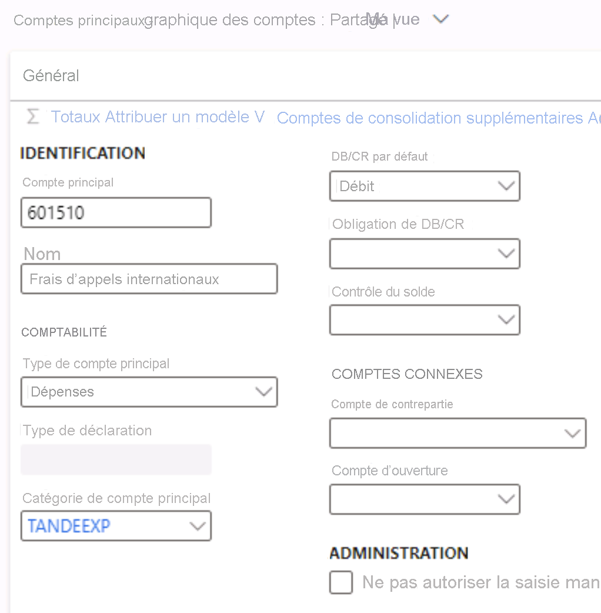

---
lab:
  title: 'Labo 1 : Créer un compte principal'
  module: 'Module 2: Learn the Fundamentals of Microsoft Dynamics 365 Finance'
ms.openlocfilehash: 6568afcb26212ab952a48dfaf7bb4f377e4ffd36
ms.sourcegitcommit: aa74c0578c7018838f0c935f5901e9c667ef0801
ms.translationtype: HT
ms.contentlocale: fr-FR
ms.lasthandoff: 07/14/2022
ms.locfileid: "147116650"
---
# Module 2 : Découvrir les principes fondamentaux de Microsoft Dynamics 365 Finance
    
## Labo 1 : Créer un compte principal

## Instructions

1. Dans la page **Accueil Finance and Operations**, en haut à droite, vérifiez que vous travaillez avec la société USMF.

2. Si nécessaire, sélectionnez la société, puis, dans le menu, sélectionnez **USMF**.

3. Dans le volet de navigation gauche, sélectionnez **Modules** > **Comptabilité** > **Plan comptable** > **Comptes** > **Comptes principaux**.

4. Dans le menu en haut sélectionnez **+ Nouveau**.

5. Entrez les valeurs suivantes dans la page du compte principal :

    - Compte principal : **601510**

    - Nom : **Frais d’appels internationaux**

    - Type de dépense principal : **Dépenses**

    - Catégorie de compte principal : **TANDEEXP**

    - DB/CR par défaut : **Débit**

 
