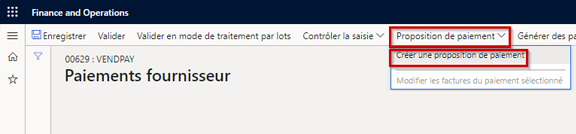
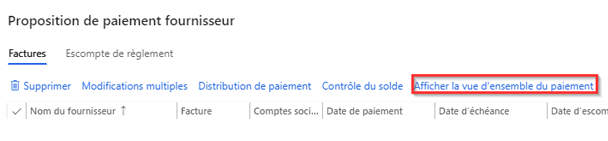
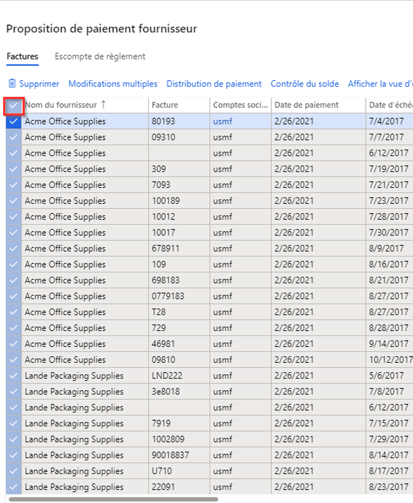
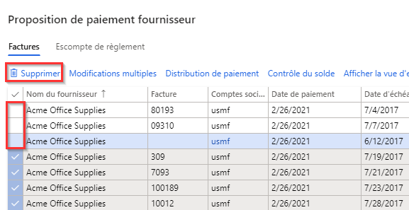

---
lab:
    title: 'Labo 2 : Créer un journal des paiements fournisseur'
    module: 'Module 2 : Découvrir les principes de base de Microsoft Dynamics 365 Finance'
---

## Labo 2 : Créer un journal des paiements fournisseur

## Objectifs

Les organisations qui paient leurs fournisseurs selon un planning récurrent peuvent maintenant automatiser la génération de propositions de paiements fournisseurs. Ces automatisations définissent les points suivants :

- Le moment où ces propositions sont lancées
- Les critères utilisés pour sélectionner les factures à régler
- Le journal des paiements fournisseur utilisé pour enregistrer les paiements en question

Ces automatisations de propositions de paiement ne lancent pas les paiements automatiquement. Vous pouvez donc continuer à utiliser vos processus de validation et vos workflows habituels pour approuver les paiements ainsi créés.

Créez une nouvelle entrée dans le journal des paiements fournisseur ainsi qu’une proposition de paiement.

## Mise en place du labo

   - **Durée estimée** : 10 minutes

## Instructions

1. Sur la page d’accueil de Finance and Operations, en haut à droite, vérifiez que vous travaillez avec la société USMF.

1. Si nécessaire, sélectionnez la société, puis, dans le menu, **USMF**.

1. Dans le volet de navigation de gauche, sélectionnez **Modules** > **Comptabilité fournisseur** > **Paiements** > **Journal des paiements fournisseur**.

1. Dans le menu en haut sélectionnez **+ Nouveau**.

1. Notez le nouveau numéro de feuille qui a été créé.

1. Dans le champ **Nom**, saisissez **Paiem**, puis sélectionnez **Paiement fournisseur** dans la liste filtrée.

1. Dans le menu en haut, sélectionnez **Lignes**.

1. Sur la page Paiements fournisseur, dans le menu en haut, sélectionnez **Proposition de paiement** > **Créer une proposition de paiement**.  
    La proposition de paiement est une requête qui permet de sélectionner les factures à payer. Vous pouvez modifier la liste des factures à payer avant de créer ou de générer les paiements fournisseur.

    

1. Dans le volet Proposition de paiement fournisseur, sous **CRITÈRES DE SÉLECTION DE LA FACTURE**, sélectionnez le menu **Sélectionner les factures par**, passez en revue les options disponibles, puis sélectionnez **Date d’échéance**.

1. Dans les champs **Date de début** et **Date de fin**, supprimez toute valeur existante. Pour cet exercice, ces plages de dates sont laissées vides.

    >[!REMARQUE] Vous pouvez utiliser une date de paiement minimale comme date de paiement. La date de paiement minimale est la première date utilisée lors de la création des paiements. Par exemple, si une facture a une date d’échéance après la date de paiement minimale, la date d’échéance devient la date de paiement au lieu de la date de paiement minimale pour payer la facture à la dernière date possible.

1. Développez **Enregistrements à inclure** et examinez les options.  
    Le filtre est souvent utilisé pour restreindre le nombre de factures sélectionnées pour le paiement par groupe de fournisseurs ou par mode de paiement. Par exemple, vous pourriez ajouter un filtre pour payer uniquement les factures par chèque dans ce cycle de paie.

1. Développez **Paramètres avancés** et examinez les options disponibles.  
    Les paramètres supplémentaires peuvent être utilisés pour définir la devise de paiement ou pour activer les paiements centralisés pour ce cycle de paie.

1. Sélectionnez **OK**.  
    Une fois que vous avez cliqué sur OK, les résultats de la requête apparaissent. Si vous ne souhaitez pas prévisualiser la liste des factures sélectionnées pour payer, vous pouvez revenir au raccourci Paramètres et changer le paramètre **Créer des paiements sans prévisualiser la facture** en **Oui**.

1. Dans la fenêtre Proposition de paiement fournisseur, sélectionnez **Afficher la vue d’ensemble du paiement** pour afficher les paiements qui sont créés pour le fournisseur sur la facture sélectionnée.

    

1. Dans le menu, sélectionnez **Masquer la vue d’ensemble du paiement** pour masquer les paiements.

1. Sélectionnez l’icône de coche à gauche de l’en-tête de la colonne **Nom du fournisseur** pour sélectionner toutes les factures.

    

1. Décochez la case des trois premières factures, puis, dans le menu, sélectionnez **Supprimer** pour supprimer toutes les autres factures.

    

1. Sélectionnez **Oui** dans la boîte de dialogue.

1. Examinez les trois factures restantes.

1. Pour exporter la liste des factures vers Excel, cliquez avec le bouton droit sur la grille et sélectionnez une option d’exportation.

1. Dans l’angle inférieur droit, sélectionnez **Créer des paiements** pour créer les paiements fournisseur dans la feuille paiement.

1. Consultez la liste des paiements fournisseur.
