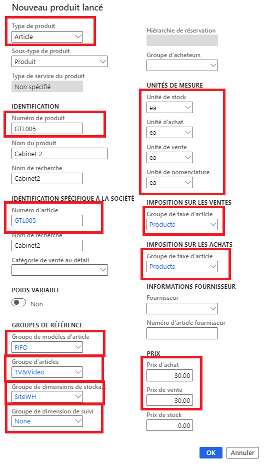
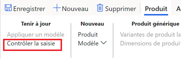

---
lab:
  title: "Labo\_1\_: Créer un nouveau produit"
  module: 'Module 3: Learn the Fundamentals of Microsoft Dynamics 365 Supply Chain Management'
---

# Module 3 : Découvrir les principes fondamentaux de Microsoft Dynamics 365 Supply Chain Management

## Labo 1 : Créer un nouveau produit

## Objectif

Dans Contoso Entertainment System USA (USMF), vous devez créer un article pour une nouvelle configuration d’armoire à acheter auprès des fournisseurs. 

## Mise en place du labo

   - **Durée estimée** : 10 minutes

## Instructions

1.  Dans la page d’accueil **Finance and Operations**, en haut à droite, vérifiez que vous travaillez avec la société **USMF**. 

1.  Si nécessaire, sélectionnez la société, puis, dans le menu, **USMF**.

1.  En haut à gauche, sélectionnez le menu hamburger **Développer le volet de navigation**. 

1.  Dans le volet de navigation, dans le module **Gestion des informations sur les produits**, sélectionnez **Produits** > **Produits lancés**. 

1.  Dans la page  **Détails des produits lancés**, sélectionnez **+ Nouveau** dans le volet Actions. 

1.  Dans le volet **Nouveau produit lancé**, dans le champ  **Type de produit** , que **Article** est sélectionné. 

1.  Dans le champ  **Sous-type de produit** , vérifiez que **Produit** est sélectionné. 

1.  Sélectionnez le menu  **Groupe de dimension de suivi** , puis entrez ou sélectionnez  `None` 

1.  Sous **IDENTIFICATION**, dans  **Numéro de produit**, entrez  `GTL007`

1.  Dans la zone  **Nom du produit** , entrez  `Cabinet 2`

1.  Sous **GROUPES DE RÉFÉRENCE**, dans le champ **Groupe de modèles d’article** , entrez ou sélectionnez `FIFO`, First In-First Out (premier entrée, premier sorti). 

1.  Dans le champ **Groupe d’articles**, entrez ou sélectionnez  `TV&Video` 

1.  Pour **Groupe de dimensions de stockage**, entrez ou sélectionnez `SiteWH` 

1.  Sous **UNITÉS DE MESURES**, vérifiez que les valeurs suivantes sont définies : 

    | **Paramètre**    | **Valeur** |
    | :------------- | :-------- |
    | Unité de stock | ea Chaque   |
    | Unité d’achat  | ea Chaque   |
    | Unité de vente     | ea Chaque   |
    | Unité de nomenclature       | ea Chaque   |

1.  Sous **IMPOSITION SUR LES VENTES**, pour **Groupe de taxe d’article**, entrez ou sélectionnez `ALL` 

1.  Sous **IMPOSITION SUR LES ACHATS**, pour **Groupe de taxe d’article**, entrez ou sélectionnez `ALL` 

1.  Sous **PRIX**, dans la zone **Prix d’achat** , entrez `30.00`

1.  Dans le champ **Prix de vente** , entrez `30.00`

1.  Vérifiez que votre nouveau **Produit lancé** se présente comme suit : 

    

1.  Sélectionnez **OK**. 

1.  Pour vérifier que le produit est finalisé, dans le volet Actions, sous **Tenir à jour**, sélectionnez l’action **Valider**. 

    

1.  La notification confirmant que toutes les valeurs de champs obligatoires ont été validées doit alors s’afficher. 

    

1.  Sélectionnez **Enregistrer**, **fermez** toutes les pages et revenez à la page d’accueil. 

