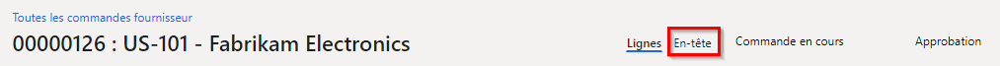
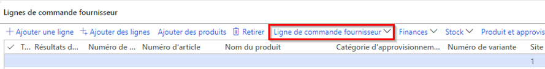

---
lab:
  title: "Labo\_2\_: Créer une commande fournisseur"
  module: 'Module 3: Learn the Fundamentals of Microsoft Dynamics 365 Supply Chain Management'
---

# Module 3 : Découvrir les principes fondamentaux de Microsoft Dynamics 365 Supply Chain Management

## Labo 2 : Créer une commande fournisseur

## Objectifs

Les commandes fournisseur sont généralement créées automatiquement dans le cadre de la planification générale, de la livraison directe et d’autres processus. Une commande fournisseur créée manuellement est généralement créée par un agent d’achats. Créez une commande fournisseur à l’aide de la société USMF.

## Mise en place du labo

   - **Durée estimée** : 10 minutes

## Instructions

1. Sur la page d’accueil de Finance and Operations, en haut à droite, vérifiez que vous travaillez avec la société USMF.

1. Si nécessaire, sélectionnez la société, puis, dans le menu, sélectionnez **USMF**.

1. En haut à gauche, sélectionnez le menu hamburger **Développer le volet de navigation**.

1. Sélectionnez **Modules** > **Approvisionnements** > **Commandes fournisseur** > **Toutes les commandes fournisseur**.

1. Sur la page Toutes les commandes fournisseur, dans le menu supérieur, sélectionnez **+ Nouvelle**.

1. Dans le volet Créer une commande fournisseur, sélectionnez le menu **Compte fournisseur**, puis sélectionnez **US-101**.

1. Lorsque vous sélectionnez un fournisseur, les détails de l’enregistrement du fournisseur, tels que l’adresse, le compte de facturation, les conditions de livraison et le mode de livraison, sont copiés comme valeurs par défaut dans l’en-tête commande. Vous pouvez modifier ces valeurs à tout moment.

1. Développez la section **Général**.

1. Sous **DIMENSIONS DE STOCKAGE**, sélectionnez le menu **Site** et passez en revue la liste des sites.

1. Le champ Site, avec le champ Entrepôt, spécifie l’endroit dans lequel les produits ou services achetés doivent être livrés. Le site est l’adresse de livraison par défaut. Les deux champs peuvent être renseignés avec des valeurs configurées pour le fournisseur sélectionné, ou vous pouvez les spécifier manuellement.

1. Sous **DATES**, le champ Date de livraison permet de spécifier quand les biens et services achetés doivent être livrés.

1. Vous pouvez indiquer une date de livraison unique pour la commande, ou les lignes de commande individuelles peuvent recevoir des dates de livraison uniques. Si la date de livraison indiquée ici ne peut pas être respectée pour des produits ou services spécifiques en raison de délais plus longs, ces lignes sont créées avec une date de livraison ultérieure pour tenir compte de cela.

1. Développez la section **Administration**. La zone **Auteur commande** peut être utilisée pour indiquer qui passe la commande.

1. Cela peut être pratique à partager avec le fournisseur au cas où il aurait besoin de contacter cette personne. La valeur peut être attribuée automatiquement si le compte utilisateur actuel est associé à un nom sur la page Utilisateurs.

1. Sélectionnez **OK**.

1. L’en-tête commande est maintenant créé. Lorsque vous travaillez avec des lignes de commande fournisseur, seul un résumé des informations d’en-tête s’affiche. Si vous avez besoin d’afficher le reste des informations, sélectionnez **En-tête**.

    

1. Sous **Lignes de commande fournisseur**, dans le menu, sélectionnez **Ligne de commande fournisseur**.

    

1. Sous **AFFICHAGE**, sélectionnez **Dimensions**.

1. Les produits peuvent être dans des variantes qui sont différenciées par des dimensions, telles que la couleur, la taille ou le style. Les produits peuvent également être configurés pour utiliser des dimensions de stockage, telles que le site et l’entrepôt. Il existe également des dimensions de suivi facultatives, telles que les numéros de lot et de série. Pour améliorer l’efficacité de la saisie des commandes, vous pouvez ajouter les champs de dimension que vous utilisez généralement directement dans la grille de commande.

1. Dans le volet d’affichage Dimensions, sous **DIMENSIONS DE PRODUIT**, cochez la case **Couleur**.

1. Facultatif : Si vous sélectionnez le bouton bascule Enregistrer le paramétrage, les dimensions que vous avez choisies s’afficheront également sur la grille des lignes de commande la prochaine fois que vous ouvrirez la page de commande fournisseur.

1. Sélectionnez **OK**.

1. Sélectionnez le menu de la cellule **Numéro d’article**, puis sélectionnez **T0004**.

1. N’oubliez pas que vous pouvez également taper dans la zone de filtre au lieu de faire défiler la liste.

1. Les lignes de commande sont créées pour les produits et services en spécifiant un numéro d’article ou en tant que dépenses en indiquant une catégorie d’approvisionnement.

1. La catégorie d’approvisionnement est utilisée pour ajouter des lignes à l’endroit où les articles achetés sont passés en charges directement, plutôt que d’entrer dans le stock. Cela signifie que si vous devez imputer un achat, vous pouvez le faire en créant une ligne de commande fournisseur qui spécifie une catégorie d’approvisionnement, plutôt que de créer une ligne avec un numéro d’article. Les articles peuvent également être associés à une catégorie d’approvisionnement et dans ce cas, celle-ci s’affiche à titre informatif uniquement.

1. Sélectionnez le menu **Couleur**, passez en revue les options disponibles, puis sélectionnez l’une des couleurs ou combinaisons de couleurs.

1. Le site et l’entrepôt sont généralement renseignés avec les valeurs de l’en-tête commande, mais il est possible de remplacer les champs si certaines lignes doivent être livrées à des emplacements différents.

1. Dans la zone **Quantité**, saisissez **10**.

1. La quantité est automatiquement renseignée avec la quantité minimale de commande du produit si cela est bien configuré, ou avec la valeur 1.

1. Quelques informations supplémentaires :

    - **Unité** : Indique l’unité de mesure de la quantité commandée. Normalement, l’unité est automatiquement fournie à partir de l’unité d’achat sur les données principales du produit.

    - **Prix unitaire** : Contient une valeur provenant d’un contrat d’achat ou d’un accord commercial. Il est possible de modifier le prix unitaire de lignes de commande individuelles : par exemple si un prix unique est négocié avec le fournisseur.

    - **Remise** : Représente un montant de remise par unité. Cette remise réduit donc le prix unitaire. Elle est généralement fournie automatiquement à partir d’accords d’achat ou d’accords commerciaux, mais il est possible de la remplacer sur des lignes individuelles si des remises uniques ont été négociées avec le fournisseur.

    - **Pourcentage de remise** : Une fois saisi, il réduit le montant net de la ligne en conséquence. Il est souvent fourni automatiquement à partir d’accords d’achat ou d’accords commerciaux, mais il est possible de le remplacer sur des lignes individuelles si un pourcentage de remise a été négocié avec le fournisseur.

    - **Montant net** : Calculé à partir d’autres champs de la ligne, notamment la quantité, le prix unitaire, la remise et le pourcentage de remise. Il est possible de modifier le montant net, mais les champs Prix unitaire, Remise et Pourcentage de remise sont vides et lorsque vous passez à la ligne, le montant affiché est proportionnel au montant net. Généralement, le champ Montant net n’est utilisé que pour afficher le montant net de la ligne.

1. Sous les lignes de la commande fournisseur, au bas de la page, sélectionnez **Détails de ligne**.

1. Sélectionnez l’onglet **Livraison**.

1. Une date de livraison unique peut être affectée à chaque ligne de commande. La date est héritée du champ de l’en-tête commande fournisseur, mais vous pouvez la modifier.

1. Fermez la page Ligne de commande fournisseur.

1. Sur la page Toutes les commandes fournisseur, utilisez la fonctionnalité de filtre et recherchez votre nouvelle commande fournisseur.

1. Une fois terminé, fermez la page Toutes les commandes fournisseur et revenez à la page d’accueil.
