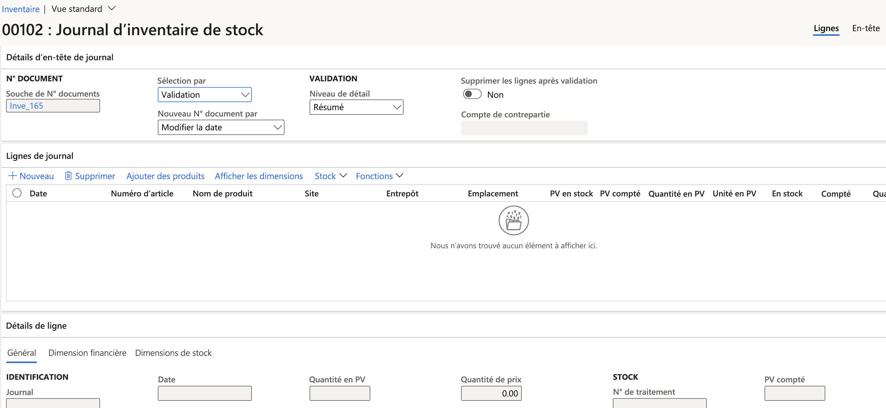
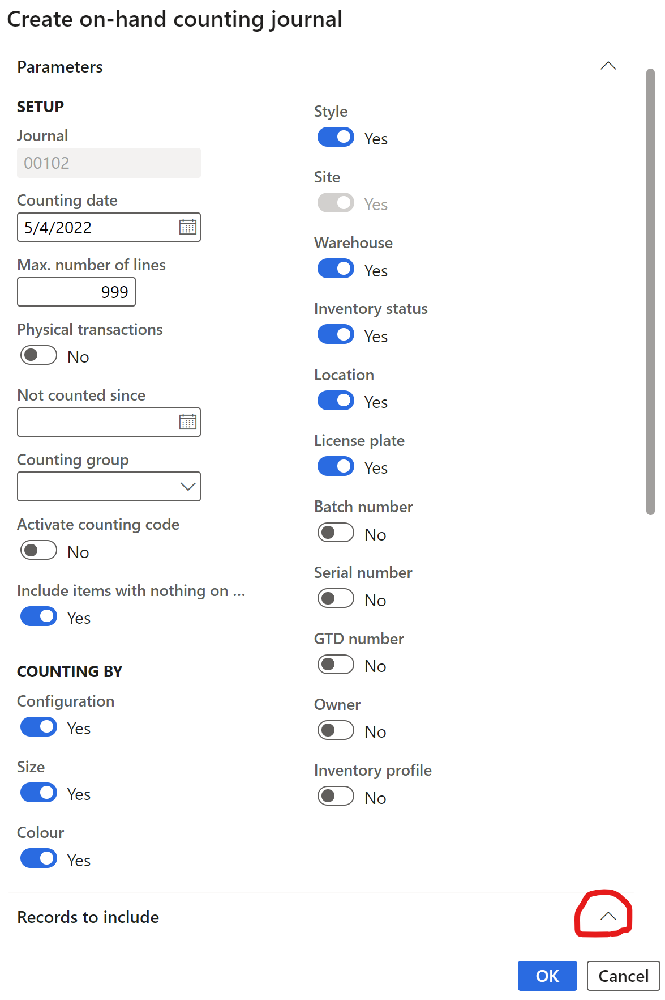

---
lab:
  title: "Labo 3\_: Créer un journal d’inventaire"
  module: 'Module 3: Learn the Fundamentals of Microsoft Dynamics 365 Supply Chain Management'
---

# Module 3 : Découvrir les principes fondamentaux de Microsoft Dynamics 365 Supply Chain Management

## Labo 3 : Créer un journal d’inventaire

## Mise en place du labo

   - **Durée estimée** : 10 minutes

## Instructions

1.  Dans la page d’accueil **Finance and Operations**, en haut à droite, vérifiez que vous travaillez avec la société **USMF**. Si nécessaire, sélectionnez la société puis, dans le menu déroulant, sélectionnez **USMF**. 

2.  Dans le volet de navigation de gauche, dans le module **Gestion des stocks**, sélectionnez **Entrées de journal** > **Inventaire des articles** > **Comptage**. 

3.  Sélectionnez le bouton **+ Nouveau** dans le volet Actions. Le volet de la boîte de dialogue **Créer le journal de stock** s’affiche. Cliquez sur le bouton **OK**. 

4.  Le formulaire **Journal d’inventaire de stock** s’affiche avec des informations d’en-tête et de lignes. 

    

5.  Dans le volet Actions, sélectionnez **Créer des lignes -&gt; Disponible**. 

6.  Dans le volet de la boîte de dialogue **Créer un journal d’inventaire du disponible**, définissez les champs **Entrepôt**, **Statut du stock**, **Emplacement** et **Contenant** sur **Oui**. 

    

7.  Développez la section **Enregistrements à inclure** et sélectionnez le bouton **Filtrer**. Pour le champ **Numéro d’article**, entrez `A0001` dans le champ **Critères**, puis sélectionnez **OK**. 

8.  Sélectionnez **OK** au bas du volet de la boîte de dialogue **Créer un journal d’inventaire du disponible**. 

    La quantité disponible de l’article **A0001** apparaît dans la grille **Lignes de journal** avec la décomposition du site, de l’entrepôt et de l’emplacement. 

9.  Dans la colonne **Compté** de la section **Ligne de journal**, mettez en correspondance les nombres comptés pour chaque site/entrepôt et emplacement. Notez les points suivants : 

    - Si la quantité **Disponible** est égale à celle **Comptée**, le champ **Quantité** est vide. 

    - Si la valeur du champ **Compté** est supérieure à celle du champ **Disponible**, le champ **Quantité** contient une valeur positive. 

    - Si la valeur du champ **Compté** est inférieure à celle du champ **Disponible**, le champ **Quantité** contient une valeur négative. 

10. Remplacez l’année du champ **Date** de chaque ligne par 2022. 

11. Sélectionnez le bouton **Valider** dans le volet Actions, puis sélectionnez **OK** dans le volet de la boîte de dialogue. 

12. Sélectionnez le bouton **Valider**. 

13. **Fermez** la page et revenez à la page d’accueil. 

