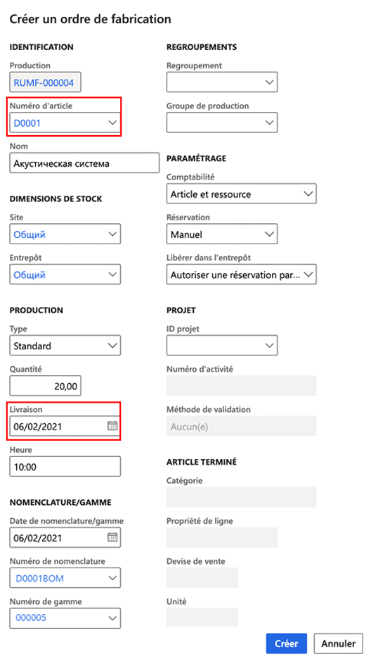

---
lab:
  title: "Labo\_4\_: Créer un ordre de fabrication"
  module: 'Module 3: Learn the Fundamentals of Microsoft Dynamics 365 Supply Chain Management'
---

# Module 3 : Découvrir les principes fondamentaux de Microsoft Dynamics 365 Supply Chain Management

## Labo 4 : Créer un ordre de fabrication

## Objectif

L’ordre de fabrication contient des informations sur ce qui doit être produit, la quantité et la date de fin prévue. Il contient également des informations sur les matériaux à utiliser et sur les processus à mettre en œuvre pour produire l’article.

Vous devez créer un ordre de fabrication pour votre entreprise.

## Mise en place du labo

   - **Durée estimée** : 5 minutes

## Instructions

1.  Dans la page d’accueil **Finance and Operations**, en haut à droite, vérifiez que vous travaillez avec la société **USMF**. 

1.  Si nécessaire, sélectionnez la société, puis, dans le menu, **USMF**. 

1.  Dans le volet de navigation de gauche, dans le module **Contrôle de la production**, sélectionnez **Ordres de fabrication** > **Tous les ordres de fabrication**. 

1.  Dans le volet Actions, sélectionnez **Nouvel ordre de fabrication**. 

1.  Sous **IDENTIFICATION**, dans le champ **Numéro d’article**, entrez `D0001` et sélectionnez l’élément **MidRangeSpeaker**. 

1.  Sous **PRODUCTION**, dans le champ **Livraison**, sélectionnez une date postérieure d’un mois à la date du jour. 
   
    > **Remarque :** La date de **livraison** indique à quel moment l’ordre de fabrication doit prendre fin pour une livraison dans les temps. Cette date peut être utilisée dans le processus de planification. Par exemple, vous pouvez planifier la commande à rebours à partir de la date de livraison. 

1.  Dans le champ **Quantité**, entrez `20.00` 

    > **Remarque :** Sous **NOMENCLATURE/GAMME**, le champ **Numéro de nomenclature** affiche automatiquement le numéro de toute nomenclature active pour l’article actuel, mais vous pouvez modifier la nomenclature de l’ordre de fabrication en sélectionnant une nomenclature active dans la liste des versions de nomenclature approuvées. Le champ **Numéro de gamme** affiche automatiquement le numéro de toute gamme active pour l’article actuel, mais vous pouvez modifier la gamme de l’ordre de fabrication en sélectionnant une gamme active dans la liste des versions de gamme approuvées. 

    

1.  Sélectionnez **Create** (Créer). 

1.  **Fermez** la page et revenez à la page d’accueil. 

