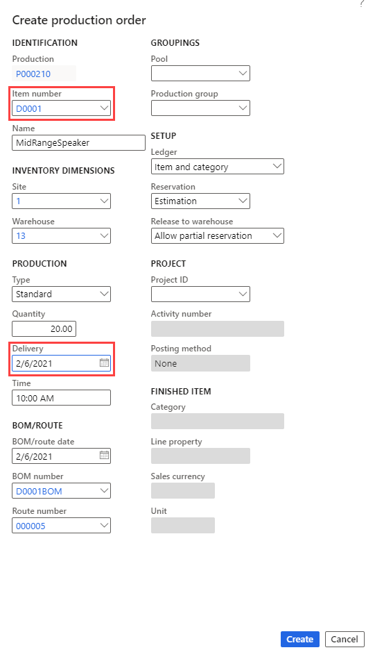

---
lab:
  title: "Labo\_4\_: Créer un ordre de fabrication"
  module: 'Module 3: Learn the Fundamentals of Microsoft Dynamics 365 Supply Chain Management'
---

## Labo 4 : Créer un ordre de fabrication

## Objectifs

The production order contains information about what will be produced, the quantity to produce, and the planned finish date. It also contains information about which materials to consume and which process to follow to produce the item.

Vous devez créer un ordre de fabrication pour votre entreprise.

## Mise en place du labo

   - **Durée estimée** : 5 minutes

## Instructions

1. Sur la page d’accueil de Finance and Operations, en haut à droite, vérifiez que vous travaillez avec la société USMF.

1. Si nécessaire, sélectionnez la société, puis, dans le menu, **USMF**.

1. Dans le volet de navigation de gauche, sélectionnez **Modules** > **Contrôle de la production** > **Ordres de fabrication** > **Tous les ordres de fabrication**.

1. Dans le menu supérieur, sélectionnez **Nouvel ordre de fabrication**.

1. Sous **IDENTIFICATION**, dans la zone **Numéro d’article**, saisissez **D0001**, puis sélectionnez l’article identifié.

1. Sous **PRODUCTION**, dans la zone **Livraison**, sélectionnez une date ultérieure d’un mois à la date du jour.  
    The delivery date indicates when the production order should end in order to deliver on time. This date can be used in the scheduling process. For example, you can schedule the order backward from the delivery date.

1. Dans le champ **Quantité**, entrez **20**.

1. Under <bpt id="p1">**</bpt>BOM/ROUTE<ept id="p1">**</ept>, the BOM number field automatically displays the number of any active BOM for the current item, but you can change the BOM for the production order by selecting an active BOM from the list of approved BOM versions. The Route number field automatically displays the number of any active Route for the current item, but you can change the Route for the production order by selecting an active Route from the list of approved Route versions.

    

1. Sélectionnez **Create** (Créer).
